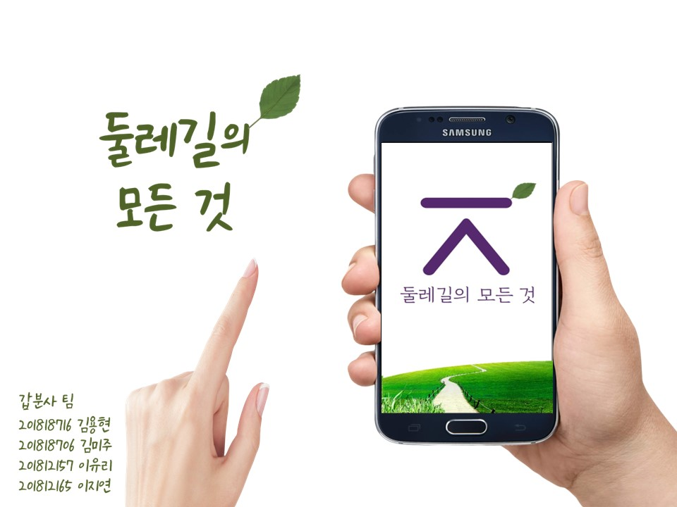
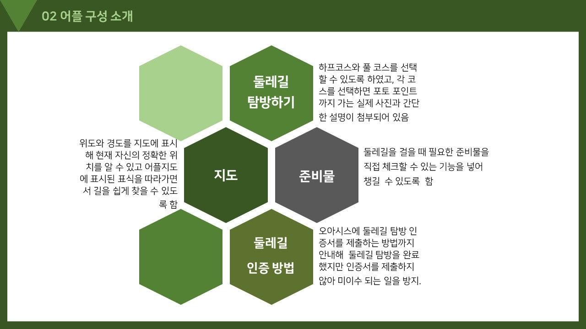
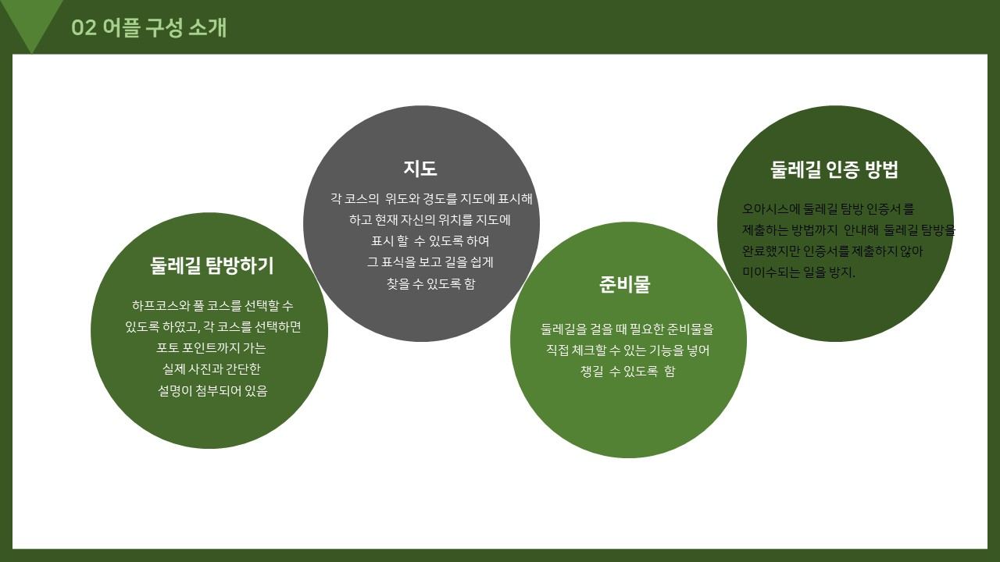

# JBNU_1-2_CED
> Creative Engineering Design. 창의적공학설계.

## 개발 환경
> MIT App Inventor (https://appinventor.mit.edu/)

## 개발 결과
> 작품경진대회 동상 수상.

## 개발 내용
> 총 팀원 4명.
>
> 전북대학교 '모험과창의' 과목 중, '둘레길 돌기'에 도움을 줄 수 있는 안드로이드 모바일 앱 개발.

---

---

